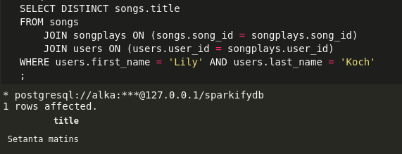
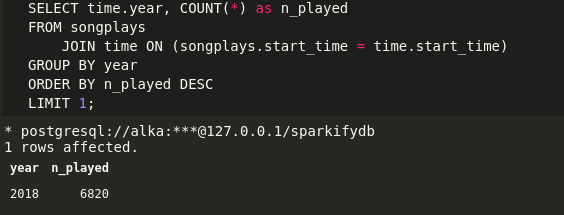

# Sparkify : Your Provider for The World Best Music Library

This repository contains scripts for **E**xtracting music data from json files, **T**ransform these data to match the **sparkifydb** database schema, and **L**oad these transformed data into the database.

Following is a diagram representing the database schema, with 1 fact table `songplays` and 4 dimension tables `users`, `time`, `songs` and `artists` :


The database design follows a `star schema` to help our analyst team, **The Sparkalysts**, in their mission to answering the questions running through the head of our CEO **The Big Spark** such as :

1. List of songs listened by user `Lily` `Koch` ?
2. In which year did our users listened the most to music ?
3. ...

## Project Structure

The project is structured as follow:

* A folder named `data` contains two subdirectories as provided by the project template : `log_data` (containing users' activities data) and `song_data` (containing songs and artists data)
* A script `sql_queries.py` which contains all the SQL queries for creating the `sparkifydb`, the different tables, and some other queries.
* A script `create_tables.py` which creates the database and the defined tables
* A script `etl.py` which extracts and transforms the log and song data before loading the processed data into the tables created by the script `create_tables.py`

## Project Setup

To set everything up, there is an extra requirement in addition to those specified in the previous section : a json configuration file `config.json` located at the same level of other scripts. This file contains the credentials for connecting to the database. Following is a sample configuration file content :

```json
{
	"host": "127.0.0.1",
	"dbname": "studentdb",
	"user": "student",
	"password": "student"
}
```

The field `dbname` represent the default database name.

To set up the project the following steps can be followed in the given order :

* execute the `create_tables.py` script that will connect to the default database specified in the `config.json` file, drop the `udacitydb` database and the tables if it exists and recreate it, connect to the newly created database and drop the tables and recreates them
  
```bash
python create_tables.py
```

* execute the script `etl.py` that will process the json files and populate the database

```bash
python etl.py
```

## Example queries

Here are the results for the example of requests listed in the introduction:

1. List of songs listened by user `Lily` `Koch` ?


2. In which year did our users listened the most to music ?



## TO-DO List

* [ ] Add Analytic Dashboard for easier interaction with non-experts
* [ ] Add more data quality check
